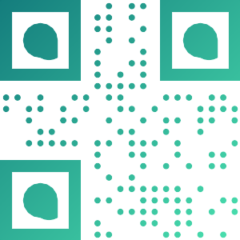

# Simple QrCode
This is a fork from [SimpleSoftwareIO/simple-qrcode](https://github.com/SimpleSoftwareIO/simple-qrcode)
========================

## Versions

| Plugin Version | Filament Version |
| --- | --- |
| `v1.x` | `v2.x` |
| `v2.x` | `v3.x` |
| `v3.x` | `v3.x` |

## Support Filament

## Introduction
Simple QrCode is an easy to use wrapper for the popular Laravel framework based on the great work provided by [Bacon/BaconQrCode](https://github.com/Bacon/BaconQrCode).  We created an interface that is familiar and easy to install for Laravel users.

## Official Documentation

Documentation for Simple QrCode can be found on our [website.](http://larazeus.com/simple-qrcode)

## Examples

 

## Used with:
- Qr Code
- ...

## Changelog

Please see [CHANGELOG](CHANGELOG.md) for more information on recent changes.

## Support
available support channels:
* open an issue on [GitHub](https://github.com/lara-zeus/bolt/issues)
* Email us using the [contact center](https://larazeus.com/contact-us)

## Contributing

Please see [CONTRIBUTING](CONTRIBUTING.md) for details.

## Security

If you find any security-related issues, please email info@larazeus.com instead of using the issue tracker.

## Credits

-   [Lara Zeus (Ash)](https://github.com/atmonshi)
-   [All Contributors](../../contributors)
-   [All Contributors in SimpleSoftwareIO/simple-qrcode](https://github.com/SimpleSoftwareIO/simple-qrcode/graphs/contributors)

## License

The MIT License (MIT). Please have a look at [License File](LICENSE.md) for more information.
